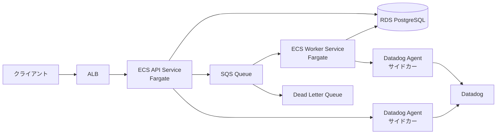
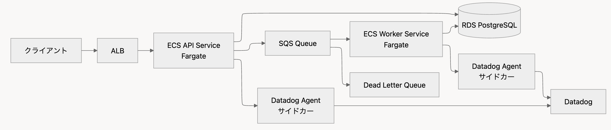
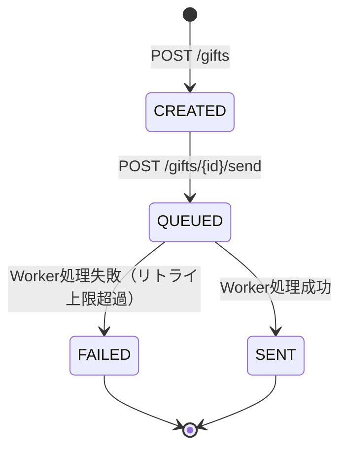
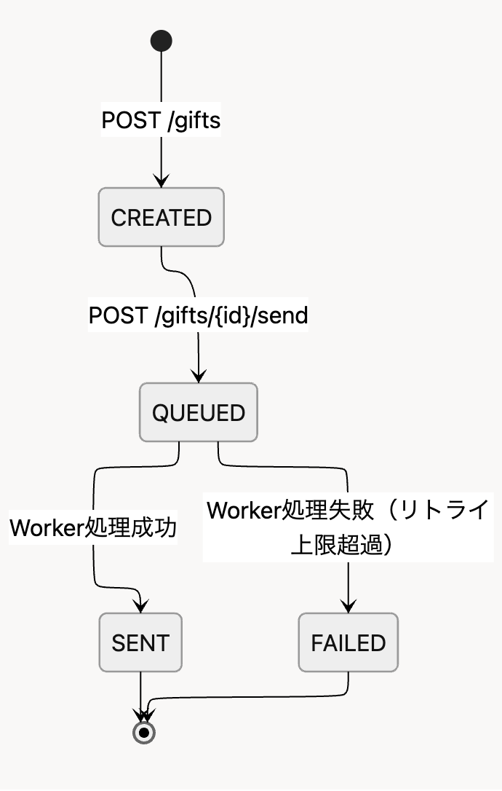

# 要件定義書

> このファイルはプロジェクトの要件を定義する最重要ドキュメントです。
> Claudeは作業開始時にこのファイルを読み込み、内容に従って作業を行います。

---

## 1. プロジェクト概要

**プロジェクト名**: ecs-sre-gift-worker（Gift API + Worker / ECS中心SRE構成）

**目的**: ECS中心のSRE/Platform構成で、以下を「小さくても実務レベルで説明可能」な形で実装する。
- TerraformによるIaC（再現性・設計判断の言語化）
- CI/CDによる安全な変更（デプロイとロールバック手順の明確化）
- 監視・運用（Logs/Monitors/Dashboard + Runbookで一次対応可能）

**対象ユーザー**:
- ギフト送信を行うエンドユーザー（API利用者）
- ダッシュボード・アラートで異常を検知し一次対応を行う運用者

**工数目安**: 20〜35時間（3〜5営業日）

---

## 2. 技術スタック

| カテゴリ | 技術 | 備考 |
|---------|------|------|
| 言語 | Go | Worker/API共通 |
| フレームワーク | 未定（軽量HTTPサーバー） | net/http or Echo 等 |
| データベース | PostgreSQL（RDS） | 最小構成 |
| キュー | Amazon SQS + DLQ | 非同期処理の中核 |
| コンテナ | ECS Fargate | APIサービス + Workerサービス |
| ロードバランサ | ALB | API前段、ヘルスチェック |
| IaC | Terraform | 全インフラの構成管理 |
| CI/CD | GitHub Actions | PR検証 + mainマージ時デプロイ |
| 監視 | Datadog | Datadog Agent サイドカー（Logs + Metrics、将来APM拡張可） |
| ログ集約 | Datadog Agent サイドカー | ECSタスク定義にサイドカーとして配置。CloudWatch Logsは補助的に利用 |
| レジストリ | Amazon ECR | コンテナイメージ格納 |
| 秘密管理 | AWS Secrets Manager / SSM Parameter Store | DBパスワード等 |

---

## 3. アーキテクチャ概要

### 3.1 システム構成図





### 3.2 通信フロー

1. `Client → ALB → ECS(API) → RDS(Postgres)`（同期）
2. `API → SQS → ECS(Worker) → RDS(Postgres)`（非同期）
3. ログは Datadog Agent サイドカー経由で Datadog へ直接送信（CloudWatch Logsは補助的に利用）

### 3.3 相関ID設計

すべてのログ・メッセージに以下を含める:
- `gift_id`: ギフトを一意に識別
- `request_id`: `Idempotency-Key` ヘッダー由来。`gift_id` と組み合わせて送信リクエストを一意に識別

---

## 4. データモデル・用語定義

### 4.1 用語定義

| 用語 | 定義 |
|------|------|
| Gift | ギフトコードとメタ情報を持つエンティティ |
| GiftCode | システムが自動生成する一意のコード文字列 |
| SendRequest | ギフト送信の依頼。冪等性キーで重複排除 |
| Idempotency-Key | クライアントが送信リクエスト時に指定する一意キー。`request_id` として扱い、`gift_id` と組み合わせて一意とする |

### 4.2 ギフト状態遷移




| 状態 | 説明 |
|------|------|
| CREATED | ギフトコード生成済み。送信未依頼 |
| QUEUED | SQSにメッセージ投入済み。Worker処理待ち |
| SENT | Worker処理成功。擬似送信完了 |
| FAILED | リトライ上限超過で最終失敗。DLQ行き |

### 4.3 テーブル設計

#### gifts テーブル

| カラム | 型 | 制約 | 説明 |
|--------|-----|------|------|
| id | UUID | PK | gift_id |
| code | VARCHAR | UNIQUE, NOT NULL | 自動生成ギフトコード |
| amount | INTEGER | NOT NULL | 金額（正の整数） |
| message | VARCHAR(500) | | ギフトメッセージ |
| status | VARCHAR(20) | NOT NULL, DEFAULT 'CREATED' | CREATED/QUEUED/SENT/FAILED |
| last_error | TEXT | | 最後のエラーメッセージ（失敗時） |
| created_at | TIMESTAMP | NOT NULL | 作成日時 |
| updated_at | TIMESTAMP | NOT NULL | 更新日時 |

#### send_requests テーブル

| カラム | 型 | 制約 | 説明 |
|--------|-----|------|------|
| gift_id | UUID | PK(複合), FK(gifts.id), NOT NULL | 対象ギフト |
| request_id | VARCHAR(255) | PK(複合), NOT NULL | Idempotency-Key由来（gift単位で一意） |
| created_at | TIMESTAMP | NOT NULL | リクエスト日時 |

---

## 5. 機能要件

### 5.1 必須機能（MVP）

#### 5.1.0 API共通仕様

- **Content-Type**: `application/json`
- **エラーレスポンス共通フォーマット**:
  ```json
  {
    "error": {
      "code": "NOT_FOUND",
      "message": "gift not found"
    },
    "request_id": "idempotency-key-string"
  }
  ```
  - `error.code`: エラー種別を識別する文字列（`VALIDATION_ERROR`, `NOT_FOUND`, `CONFLICT`, `INTERNAL_ERROR` 等）
  - `error.message`: 人間が読めるエラー説明
  - `request_id`: `Idempotency-Key` 由来（存在する場合）

#### 5.1.1 API（同期）

- **POST /gifts** - ギフト作成
  - 入力: `{ amount: integer, message?: string }`
  - 処理: ギフトコード自動生成 → DB保存（status=CREATED）
  - 出力: `{ gift_id, code, status: "CREATED", created_at }`
  - バリデーション:
    - `amount`: 必須、正の整数
    - `message`: 任意、最大500文字

- **POST /gifts/{gift_id}/send** - ギフト送信依頼
  - 入力: パスパラメータ `gift_id`、ヘッダー `Idempotency-Key`（必須）
  - 処理:
    1. `gift_id` の存在チェック
    2. 状態チェック（`SENT` は再送不可、`QUEUED` は冪等性チェックへ）
    3. `Idempotency-Key` → `request_id` として `send_requests` テーブルに保存（キーは `(gift_id, request_id)`）
    4. 同一 `(gift_id, request_id)` が既存の場合、既存結果を返却（HTTP 200、初回と同一のレスポンスボディ）
    5. DBトランザクション内で以下を実行:
       - `gifts` 行を `SELECT FOR UPDATE` で排他ロック取得（並行リクエストの二重QUEUED化を防止）
       - `gifts.status` が `CREATED` であることを再確認（ロック取得後の状態ガード）
       - `send_requests` INSERT + `gifts.status=QUEUED` UPDATE
    6. トランザクション確定後、SQSへメッセージ投入（`gift_id`, `request_id` を含む）
    7. SQS投入に失敗した場合: DBは `QUEUED` のまま確定済み。ログにエラー記録し、補償処理（後述）で対応
  - 補償処理（SQS投入失敗時）:
    - `status=QUEUED` かつ SQSメッセージ未投入の滞留レコードを検出する仕組みを将来的に検討（MVP では手動対応 + アラートで代替）
    - Worker側は `(gift_id, request_id)` で重複チェックするため、SQS再投入しても安全
  - 出力: `{ gift_id, status: "QUEUED", request_id }`
  - エラー:
    - 404: gift_id が存在しない
    - 400: Idempotency-Key ヘッダー未指定
    - 409: status が SENT で再送不可
    - 409: status が QUEUED かつ異なる request_id での送信試行（既に別リクエストで送信済み）

- **GET /gifts/{gift_id}** - ギフト状態照会
  - 入力: パスパラメータ `gift_id`
  - 出力: `{ gift_id, code, amount, message, status, last_error, created_at, updated_at }`
  - エラー:
    - 404: gift_id が存在しない

- **GET /healthz** - Livenessチェック
  - 出力: `{ status: "ok" }`
  - 用途: ALB/ECSのヘルスチェック（プロセス生存確認）

- **GET /readyz** - Readinessチェック
  - 処理: DB接続確認等、最低限の依存サービスチェック
  - 出力: `{ status: "ready" }` または `{ status: "not_ready", reason: "..." }`
  - 用途: サービス受付可否判定

#### 5.1.2 Worker（非同期）

- **SQSメッセージ処理** - 擬似送信処理の実行
  - 入力: SQSメッセージ（`gift_id`, `request_id`）
  - 処理:
    1. メッセージから `gift_id`, `request_id` を取得
    2. 重複処理チェック: `gifts.status` が `QUEUED` であることを確認。`SENT` または `FAILED` の場合はメッセージを正常消化（処理済みとして削除）
    3. 擬似送信処理実行（ランダム失敗 or 意図的な失敗フラグ対応）
    4. 成功時: 条件付きUPDATE `UPDATE gifts SET status='SENT' WHERE id=? AND status='QUEUED'` で更新（affected rows=0 の場合は他Workerが処理済みとみなしスキップ）
    5. 失敗時: SQS Redrive Policyにより再試行（最大5回）
    6. 失敗時に `ApproximateReceiveCount` を確認し、`maxReceiveCount(=5)` 到達時は Worker が条件付きUPDATE `UPDATE gifts SET status='FAILED', last_error=? WHERE id=? AND status='QUEUED'` を実行してからエラー返却（その後SQSによりDLQへ移動）
  - リトライ戦略: SQS Redrive Policy（maxReceiveCount=5）を採用し、アプリ側の独自リトライは行わない
  - 重複安全性: 条件付きUPDATE（`WHERE status='QUEUED'`）により、At-least-once配信で同一メッセージが複数回処理されても安全

#### 5.1.3 冪等性・重複排除

- **Idempotency-Key による重複排除**
  - `POST /gifts/{gift_id}/send` の `Idempotency-Key` を `request_id` として管理
  - `send_requests(gift_id, request_id, created_at)` テーブルで追跡
  - 同一 `(gift_id, request_id)` のリクエストは既存結果を返却（新規処理しない）
  - Workerも `(gift_id, request_id)` を参照し、重複更新を抑止

### 5.2 追加機能（将来対応・後回し）

- [ ] **Datadog APM**: /gifts /send のトレース、DBクエリ時間の可視化
- [ ] **Terraform module分割**: 後からの整理・再構成
- [ ] **Auto Scaling**: ECSサービスのオートスケーリング設定
- [ ] **高度なロールバック自動化**: CodeDeploy等による自動ロールバック
- [ ] **WAF / 複雑な認証 / マルチリージョン**: 設計言及のみ

### 5.3 スコープ外（やらない）

- 本物のメール/SMS送信（擬似処理のみ）
- 高負荷試験・本番相当の性能チューニング
- 監査ログ等の高度なコンプライアンス対応

---

## 6. ビジネスルール・制約

### 6.1 バリデーションルール

| エンドポイント | ルール |
|---------------|--------|
| POST /gifts | `amount` は必須・正の整数、`message` は最大500文字 |
| POST /gifts/{id}/send | `Idempotency-Key` ヘッダー必須、gift_id が存在すること、status が SENT でないこと |
| GET /gifts/{id} | gift_id が存在すること |

### 6.2 状態遷移ルール

| 現在の状態 | 許可される遷移 | トリガー |
|-----------|---------------|---------|
| CREATED | → QUEUED | POST /gifts/{id}/send |
| QUEUED | → SENT | Worker処理成功 |
| QUEUED | → FAILED | Worker処理失敗（リトライ上限超過） |
| SENT | 遷移なし（終了状態） | - |
| FAILED | 遷移なし（終了状態） | - |

> **FAILED状態の復旧について（MVP方針）**: MVPでは FAILED は終了状態とし、API経由での自動復旧パスは提供しない。DLQに滞留したメッセージの調査・再投入は Runbook に基づく手動運用で対応する。将来的に `POST /gifts/{id}/retry` 等の再送APIを検討する場合は、FAILED → QUEUED の遷移を追加する。

### 6.3 リトライポリシー

- 最大リトライ回数: 5回
- 実現方法: SQS Redrive Policy（maxReceiveCount=5）+ Workerでの `ApproximateReceiveCount` 判定
- `ApproximateReceiveCount >= 5` で失敗した場合、Workerが `gifts.status=FAILED` / `last_error` 更新後にエラー返却
- リトライ超過時: DLQへ自動移動（SQS Redrive）
- Worker側でも `(gift_id, request_id)` による重複処理防止

---

## 7. 外部インターフェース

### 7.1 AWSサービス

| サービス | 用途 | 設定概要 |
|---------|------|---------|
| ECS Fargate | API/Workerコンテナ実行 | 2サービス（api, worker） |
| ALB | APIへのルーティング | ヘルスチェック: /healthz |
| RDS PostgreSQL | データ永続化 | 最小構成、private推奨 |
| SQS | 非同期メッセージキュー | 標準キュー + DLQ |
| CloudWatch Logs | ログ集約 | Datadog転送元 |
| ECR | コンテナイメージ | api/worker用リポジトリ |
| Secrets Manager/SSM | 秘密情報管理 | DBパスワード等 |

### 7.2 SQSメッセージフォーマット

```json
{
  "gift_id": "uuid-string",
  "request_id": "idempotency-key-string"
}
```

### 7.3 外部サービス連携

| サービス | 用途 | 連携方式 |
|---------|------|---------|
| Datadog | 監視・アラート | Datadog Agent サイドカー経由で直接送信 |
| GitHub | ソースコード管理・CI/CD | GitHub Actions |

---

## 8. 非機能要件

### 8.1 SLI/SLO

#### API

| SLI | SLO（仮置き） |
|-----|--------------|
| 成功率（2xx比率） | 99.9% / 30日 |
| p95レイテンシ（/gifts, /send） | < 300ms（低負荷想定） |

#### Worker

| SLI | SLO（仮置き） |
|-----|--------------|
| 処理成功率（SENT / 全処理） | 送信要求の95%が5分以内にSENT |
| キュー滞留（Queue depth / 最古メッセージ遅延） | DLQ発生は1日0件（目標） |

> 設計判断として説明すべき: 前提（負荷/規模）と見直し方法（アラート閾値・SLOの再設計）

### 8.2 監視・アラート（Datadog）

**ダッシュボード**: 1枚（API/ALB/ECS/DB/Queueを俯瞰）

**アラート（最大6〜8個）**:

| # | アラート | 種別 | 優先度 |
|---|---------|------|-------|
| 1 | ALB 5xx増加 | メトリクス | 必須 |
| 2 | ALB HealthyHostCount低下 | メトリクス | 必須 |
| 3 | ECS running < desired（API） | メトリクス | 必須 |
| 4 | ECS running < desired（Worker） | メトリクス | 必須 |
| 5 | SQS Queue depth増加 or 最古遅延増加 | メトリクス | 必須 |
| 6 | Worker失敗ログ急増 | ログベース | 必須 |
| 7 | RDS CPU高止まり | メトリクス | 任意 |
| 8 | RDS connections急増 | メトリクス | 任意 |

### 8.3 ログ設計

すべてのログに以下フィールドを含める（JSON構造化ログ推奨）:

| フィールド | 説明 | 必須 |
|-----------|------|------|
| `gift_id` | ギフト識別子 | 処理対象がある場合 |
| `request_id` | Idempotency-Key由来 | 送信処理時 |
| `status` | 処理結果の状態 | 常時 |
| `error_code` | エラーコード | 失敗時 |
| `error_message` | エラー詳細 | 失敗時 |
| `timestamp` | ログ出力時刻 | 常時 |
| `service` | api or worker | 常時 |

API→Workerの相関: SQSメッセージに `request_id` を含め、ログ検索で1つの送信要求を端から端まで追跡可能にする。

### 8.4 セキュリティ

| 項目 | 要件 |
|------|------|
| IAM | task execution role（pull/logs）と task role（SQS/Secrets）を分離。最小権限原則 |
| 秘密情報 | DBパスワード等は Secrets Manager/SSM で管理。リポジトリに平文を置かない |
| ネットワーク | 公開は ALB のみ。DB は外部公開しない（推奨） |
| ネットワーク例外 | MVPでpublic subnet運用する場合、理由と対策を `docs/cost.md` に記載 |

### 8.5 コスト最適化

- NAT Gateway は MVP では原則回避（工数・費用削減）
- public subnet 運用時は以下を `docs/cost.md` に記載:
  - public subnet 運用の理由
  - Security Group の締め方
  - 本番ならどうするか（private + NAT 等）

---

## 9. インフラ要件（Terraform）

### 9.1 管理対象リソース

| リソース | 説明 |
|---------|------|
| VPC / Subnet / Security Group | ネットワーク基盤 |
| ALB / Target Group / Listener | API前段のロードバランサ |
| ECS Cluster | コンテナ実行基盤 |
| ECS Task Definition / Service（API） | APIコンテナ定義・サービス |
| ECS Task Definition / Service（Worker） | Workerコンテナ定義・サービス |
| RDS（PostgreSQL） | データベース（または代替） |
| SQS Queue + DLQ | メッセージキュー |
| ECR Repository | コンテナイメージ格納 |
| IAM Role / Policy | 実行権限 |
| CloudWatch Log Group | ログ出力先 |

### 9.2 ディレクトリ構成（MVP）

```
terraform/
├── main.tf
├── variables.tf
├── outputs.tf
├── vpc.tf
├── alb.tf
├── ecs.tf
├── rds.tf
├── sqs.tf
├── ecr.tf
├── iam.tf
└── cloudwatch.tf
```

> MVP は `terraform/` に集約でOK。後から `modules/` に分割整理する。

### 9.3 ドキュメント要件

- 「何を管理対象にするか/しないか」を明記
- 「差分が出たときの扱い方針」を明記

---

## 10. CI/CD要件（GitHub Actions）

### 10.1 PRトリガー

| チェック | 必須/任意 |
|---------|----------|
| アプリの最小テスト | 任意（可能なら） |
| `terraform fmt` | 必須 |
| `terraform validate` | 必須 |
| tflint | 任意（余力があれば） |

### 10.2 mainマージトリガー

| ステップ | 説明 |
|---------|------|
| Docker Build | アプリケーションのコンテナイメージビルド |
| ECR Push | ビルドしたイメージをECRにプッシュ |
| ECS Task Definition更新 | 新イメージタグでタスク定義を更新 |
| ECS Deploy | サービス更新（ローリングアップデート） |

### 10.3 失敗時対応

- 直前のtask definitionへ戻すロールバック手順を Runbook に記載
- ALB不健全/5xx検出は Datadog で確認

---

## 11. 運用要件（Runbook）

### 11.1 一次対応Runbook構成

1. **まず見るダッシュボード**: Datadog Dashboard URL/名前
2. **切り分け観点**: ALB → ECS → DB → Queue の順で確認
3. **暫定対応例**:
   - Worker desired count を増加
   - デプロイ巻き戻し（直前の task definition へロールバック）
4. **恒久対応の候補**:
   - タイムアウト/リトライ設計の見直し
   - スケーリングポリシーの調整

---

## 12. 成果物一覧

| ファイル | 説明 |
|---------|------|
| `README.md` | アーキテクチャ概要、構成図、起動手順、デプロイ手順 |
| `docs/architecture.md` | 責務分割・設計判断（NAT有無、DB選定、冪等性方針） |
| `docs/observability.md` | SLO仮置き、アラート一覧、ダッシュボード設計 |
| `docs/runbook.md` | 一次対応（切り分け→暫定→恒久） |
| `docs/cost.md` | 概算・NAT有無の判断・削減策 |
| `docs/IMPORT_NOTES.md` | Terraform知見（任意） |

---

## 13. 受け入れ基準（Definition of Done）

- [ ] `terraform apply` で環境が構築できる
- [ ] GitHub Actions で ECR → ECS へデプロイできる
- [ ] Datadog でダッシュボード1枚 + アラート6〜8個が動作する
- [ ] 代表的障害シナリオで Runbook に沿って説明できる:
  - Worker停止 → どのアラートが鳴り、何を見て切り分け、どう復旧するか
  - SQS滞留 → 同上
  - DB接続失敗 → 同上

---

## 14. 決定事項

| # | 項目 | 状態 |
|---|------|------|
| 1 | アプリケーション言語（Go or Python）の確定 | Go |
| 2 | RDS vs 代替DB（Aurora Serverless v2 / ECS上Postgres）の選定 | RDS |
| 3 | Datadog連携方式（FireLens vs Datadog Agent vs Lambda Forwarder）の選定 | Datadog Agent サイドカー |
| 4 | ギフトコードの生成方式（UUID / ランダム文字列 / 連番ベース等） | UUID |
| 5 | Worker の擬似失敗率（テスト用のランダム失敗確率の設定値） | 20% |

---

**作成日**: 2026-02-19
**最終更新**: 2026-02-19
**元資料**: claude-ext/docs/initial-requirements.md
